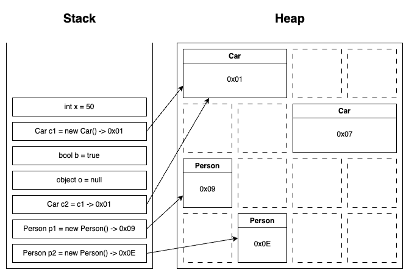

# Lesson 1: Introduction to C# & Building the Console Game

## 📌 Lesson Overview
- Introduction to C# and .NET
- Writing a simple console application
- Data Types & Variables (strings, integers, booleans, etc.)
- String manipulation (concatenation, `string.Format()`, interpolation)
- Arrays (single and multidimensional)
- Loops (`for`, `while`, `foreach`)
- Handling user input and output
- Basic error handling** (try-catch)
- Understanding stack vs. heap memory

---

# 📖 Getting Started with C# and Console Apps

## 1️⃣ What is C#?
C# is a modern, object-oriented programming language developed by Microsoft. It runs on the .NET platform, allowing developers to create:
- Console applications
- Web applications (MVC, Web API, Blazor)
- Desktop and mobile applications
- Games (Unity)

### Why Learn C#?
✅ Strongly typed (fewer runtime errors)  
✅ Object-oriented (promotes clean and structured code)  
✅ Versatile (from web apps to game development)  
✅ Backed by Microsoft (long-term support)

---

## 2️⃣ Your First C# Program

### **1️⃣ Basic "Hello, World!" Program**
```csharp
using System;

class Program
{
    static void Main()
    {
        Console.WriteLine("Hello, World!");
    }
}
```

### 🔍 Explanation:
- `using System;` → Imports basic functionality (like `Console.WriteLine`).
- `class Program` → Defines a class (everything in C# belongs to a class).
- `static void Main()` → The entry point of the program.
- `Console.WriteLine("Hello, World!");` → Outputs text to the console.

✅ This is the simplest way to print output to the console.  
❌ However, all logic is inside `Main()`, which is not ideal for structured programs.

#### **2️⃣ Moving the Output to a Separate Method**
```csharp
using System;

class Program
{
    static void Main()
    {
        PrintMessage(); // Call the method
    }

    static void PrintMessage()
    {
        Console.WriteLine("Hello, World from a method!");
    }
}
```

### **🔍 Why Use a Method?**
- **Encapsulation:** Keeps `Main()` clean and readable.
- **Reusability:** The `PrintMessage()` method can be called multiple times.
- **Modularity:** Easy to expand or modify without affecting `Main()`.


---

## 3️⃣ Data Types & Variables

C# has **strongly-typed** variables. Here are common types:

| Data Type | Example      | Description        |
|-----------|--------------|--------------------|
| `string`  | `"Hello"`    | Stores text        |
| `int`     | `42`         | Integer numbers    |
| `double`  | `3.14`       | Decimal numbers    |
| `bool`    | `true/false` | Boolean values     |
| `char`    | `'A'`        | A single character |

#### Example: Declaring and Using Variables
```csharp
string playerName = "Alice";
int playerScore = 10;
bool isGameOver = false;

Console.WriteLine($"Player: {playerName}, Score: {playerScore}, Game Over: {isGameOver}");
```

#### **Explicit Typing vs. `var`**
In older versions of C#, you had to declare a variable with its explicit type:

```csharp
int number = 5;
string name = "Alice";
double pi = 3.14;
```

Since C# 3.0, the `var` keyword allows **implicit typing**:

```csharp
var number = 5;     // Inferred as int
var name = "Alice"; // Inferred as string
var pi = 3.14;      // Inferred as double
```

**Key Differences:**
- `var` **lets C# infer the type** based on the assigned value.
- Explicit typing is **more readable** for complex types.
- `var` is **useful in LINQ queries and anonymous types**.
- Best practice: **Use `var` only when it improves readability**.

✅ **Example of mixed usage:**
```csharp
var myString = "Hello";                                       // Readable
int myInteger = MethodNameNotExplicitOnReturnType();          // Explicit for clarity
var myList = myCollection.Where(s => s.Length > 10).ToList(); // Needed for LINQ operations
var myAnonymousObject = new { Name = "Alice", Age = 30 };     // Anonymous type
```

---

## 4️⃣ String Manipulation

There are **three** common ways to format strings:

### **1️⃣ Concatenation**
```csharp
string name = "Alice";
string greeting = "Hello, " + name + "!";
Console.WriteLine(greeting);
```

### **2️⃣ Using `string.Format()`**
```csharp
string formatted = string.Format("Hello, {0}! You have {1} points.", "Alice", 10);
Console.WriteLine(formatted);
```

### **3️⃣ Using String Interpolation (Recommended)**
```csharp
string player = "Alice";
int score = 10;
Console.WriteLine($"Hello, {player}! You have {score} points.");
```

✅ **String interpolation (`$"..."`) is the cleanest and most readable option.**

---

## 5️⃣ Arrays (Single & Multidimensional)

### **1️⃣ Single-Dimensional Array**
```csharp
int[] numbers = { 1, 2, 3, 4, 5 };
Console.WriteLine(numbers[0]); // Output: 1
numbers[2] = 99;               // Modify an element
```

### **2️⃣ Multidimensional Array (Tic-Tac-Toe Board)**
```csharp
char[,] board = {
    {'X', 'O', 'X'},
    {'O', 'X', 'O'},
    {'X', ' ', 'O'}
};
Console.WriteLine(board[1, 2]); // Output: O
```

✅ **Multidimensional arrays are useful for grids like a Tic-Tac-Toe board!**

---

## 6️⃣ Loops in C#

### **1️⃣ `for` Loop**
```csharp
for (int i = 1; i <= 5; i++)
{
    Console.WriteLine($"Iteration {i}");
}
```

### **2️⃣ `while` Loop**
```csharp
int counter = 1;
while (counter <= 5)
{
    Console.WriteLine($"Iteration {counter}");
    counter++;
}
```

### **3️⃣ `foreach` Loop (for collections)**
```csharp
string[] players = { "Alice", "Bob", "Charlie" };
foreach (string player in players)
{
    Console.WriteLine($"Player: {player}");
}
```

---

## 7️⃣ User Input & Output

```csharp
Console.Write("Enter your name: ");
string name = Console.ReadLine();

Console.WriteLine($"Welcome, {name}!");
```

---

## 8️⃣ Error Handling with Try-Catch

```csharp
try
{
    Console.Write("Enter a number: ");
    int number = Convert.ToInt32(Console.ReadLine());
    Console.WriteLine($"You entered: {number}");
}
catch (FormatException)
{
    Console.WriteLine("Invalid input! Please enter a valid number.");
}
```

---

## 9️⃣ Stack vs. Heap Memory
### **Stack (Value Types)**
- Stores **primitive** data types (`int`, `double`, `bool`, etc.).
- Fast access.
- Memory is automatically released when a function ends.

### **Heap (Reference Types)**
- Stores **objects** (`string`, `arrays`, `classes`).
- Requires garbage collection.
- Slightly slower due to dynamic allocation.

### **Example: Stack vs. Heap**

```csharp
int x = 50;               // Stack
Car c1 = new Car();       // Heap
bool b = true;            // Stack
object o = null;          // Does not point to any memory location
Car c2 = c1;              // Points to the same memory location as c1
Person p1 = new Person(); // Heap
Person p2 = new Person(); // Heap
```

---

## 🚀 End of Lesson 1
